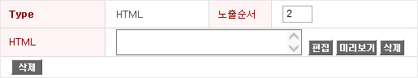
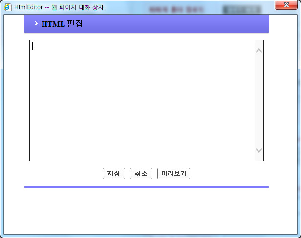

# 모바일 CMTool 개발 iframe 추가 방법

쿠폰, 상품 등 개발 또는 이벤트플렛폼으로 쿠폰번호 생성시

쿠폰 개발 url 또는 쿠폰리워드url 을 아이프레임으로 넣는 방법에 대한 설명입니다


### HTML 추가

CMTool의 모바일 부분에서 `HTML`을 선택하고 `추가` 버튼을 누른다


### 추가된 템플릿을 선택

추가된 템플릿의 `편집` 버튼을 누른다




### HTML 에디트창에 ifrmae 추가

팝업으로 열린 에디트창에 HTML을 입력한다




위와 같은 에디트창에 다음 소스를 입력한다


`iframe` 영역이 한 개 일때

```
<style>
    *{padding: 0; margin:0; border: 0;}
    #cdIncCoupon{position:relative; width:100%;}
    #cdIncCoupon img{vertical-align: top; width: 100%;}
</style>
<div id="cdIncCoupon">
    <iframe src="쿠폰경로" width="100%" height="100%" frameborder="0" scrolling="no"></iframe>
</div>
```

`iframe` 영역이 두 개 일때

```
<style>
    *{padding: 0; margin:0; border: 0;}
    #cdIncCoupon{position:relative; width:100%;}
    #cdIncCoupon li{list-style:none;}
    #cdIncCoupon img{vertical-align: top; width: 100%;}
    #cdIncCoupon ul{width: 100%;}
    #cdIncCoupon ul li{float:left;width:50%;}
</style>
<div id="cdIncCoupon">
    <ul>
        <li><iframe src="쿠폰경로" width="100%" height="100%" frameborder="0" scrolling="no"></iframe></li>
        <li><iframe src="쿠폰경로" width="100%" height="100%" frameborder="0" scrolling="no"></iframe></li>
    </ul>
</div>
```


