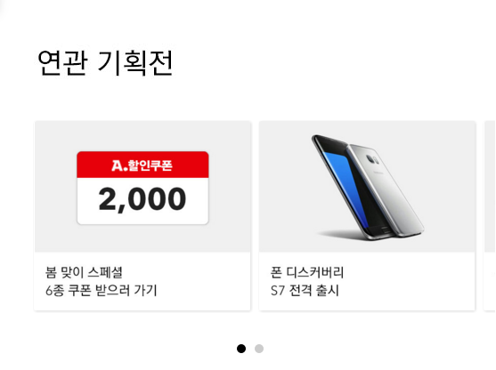
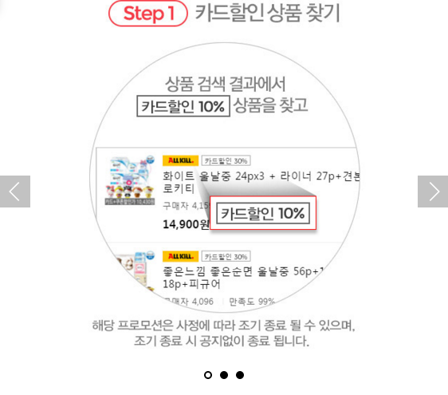

# Swiper Banner

좌우 스와이프 되는 배너들 입니다


### 연관기획전


html 파일


```html
<div id="p_swiper_promotion">
	<h3></h3>
	<div class="swiper-container">
		<div class="swiper-wrapper">
			<div class="swiper-slide">
				<a href="http://promotion.auction.co.kr/promotion/mobile/eventview.aspx?txtMD=0880520F1D"></a>
			</div>
			<div class="swiper-slide">
				<a href="http://promotion.auction.co.kr/promotion/mobile/eventview.aspx?txtMD=087FF838BF09"></a>
			</div>
			<div class="swiper-slide">
				<a href="http://promotion.auction.co.kr/promotion/mobile/eventview.aspx?txtMD=084AA7016E&skipKMS=true"></a>
			</div>

		</div>
	</div>

	<!-- Add Pagination -->
	<div class="swiper-pagination"></div>
</div>

<link rel="stylesheet" href="http://eventimg.auction.co.kr/md/auction/0868D4BD4A/swiper.min.css">
<script type="text/javascript" src="http://script.auction.co.kr/common/jquery.js"></script>
<script src="http://eventimg.auction.co.kr/md/auction/0868D4BD4A/swiper.jquery.min.js"></script>
<script src="http://eventimg.auction.co.kr/md/auction/0868D4BD4A/swiper.min.js"></script>
<!-- template setting -->
<style type="text/css">
	/* swiper - promotion styles */
	#p_swiper_promotion {
		position:relative;
		width:100%;
		overflow:hidden;
		padding-bottom:10%;
	}
	#p_swiper_promotion .swiper-container {
		width:70%;
		overflow:visible;
		float:left;
		padding-left:4%;
	}
	#p_swiper_promotion .swiper-wrapper {
		height: 100%;
		padding:1%;
	}
	#p_swiper_promotion .swiper-slide {
		position:relative;
		/* Center slide text vertically */
		display: -webkit-box;display: -ms-flexbox;display: -webkit-flex;display: flex;
		-webkit-box-pack: center;-ms-flex-pack: center;-webkit-justify-content: center;justify-content: center;
		-webkit-box-align: center;-ms-flex-align: center;-webkit-align-items: center;align-items: center;
		overflow:hidden;
		-webkit-box-shadow: 1px 1px 4px rgba(0, 0, 0, 0.15);
		-moz-box-shadow: 1px 1px 4px rgba(0, 0, 0, 0.15);
		box-shadow: 1px 1px 4px rgba(0, 0, 0, 0.15);
		-webkit-border-radius:2px;
		-moz-border-radius:2px;
	}
	#p_swiper_promotion .swiper-slide img{
		width:100%;
	}

	#p_swiper_promotion .swiper-pagination{
		width:100%;text-align:center;
		position:absolute;bottom:3%;left:0;
	}
	#p_swiper_promotion .swiper-pagination-bullet{
		width:6px;height:6px;
		margin:0 5px;
		background:#000;
		border:2px #000 solid;
		border-radius:100%;
		opacity:0.2;
	}
	#p_swiper_promotion .swiper-pagination-bullet-active{
		border:2px #000 solid;
		opacity:1;
		background:#000;
	}
</style>
<script type="text/javascript">
	$(document).ready(function(){			
		var pm_swiper = new Swiper('#p_swiper_promotion .swiper-container', {
			pagination: '#p_swiper_promotion .swiper-pagination',
			paginationClickable: true,
			slidesPerView: 1,
			spaceBetween: 10,
			autoHeight: true,
			loop: false
		});
	});
</script>
```


### 연관기획전



html 파일


```html
<div id="p_swiper_promotion">
	<h3></h3>
	<div class="swiper-container">
		<div class="swiper-wrapper">
			<div class="swiper-slide">
				<a href="http://promotion.auction.co.kr/promotion/mobile/eventview.aspx?txtMD=0880520F1D"></a>
			</div>
			<div class="swiper-slide">
				<a href="http://promotion.auction.co.kr/promotion/mobile/eventview.aspx?txtMD=087FF838BF09"></a>
			</div>
			<div class="swiper-slide">
				<a href="http://promotion.auction.co.kr/promotion/mobile/eventview.aspx?txtMD=084AA7016E&skipKMS=true"></a>
			</div>

		</div>
	</div>

	<!-- Add Pagination -->
	<div class="swiper-pagination"></div>
</div>

<link rel="stylesheet" href="http://eventimg.auction.co.kr/md/auction/0868D4BD4A/swiper.min.css">
<script type="text/javascript" src="http://script.auction.co.kr/common/jquery.js"></script>
<script src="http://eventimg.auction.co.kr/md/auction/0868D4BD4A/swiper.jquery.min.js"></script>
<script src="http://eventimg.auction.co.kr/md/auction/0868D4BD4A/swiper.min.js"></script>
<!-- template setting -->
<style type="text/css">
	/* swiper - promotion styles */
	#p_swiper_promotion {
		position:relative;
		width:100%;
		overflow:hidden;
		padding-bottom:10%;
	}
	#p_swiper_promotion .swiper-container {
		width:90%;
		overflow:visible;
		margin:0 auto;
	}
	#p_swiper_promotion .swiper-wrapper {
		height: 100%;
		padding:1%;
	}
	#p_swiper_promotion .swiper-slide {
		position:relative;
		overflow:hidden;
		-webkit-box-shadow: 1px 1px 4px rgba(0, 0, 0, 0.15);
		-moz-box-shadow: 1px 1px 4px rgba(0, 0, 0, 0.15);
		box-shadow: 1px 1px 4px rgba(0, 0, 0, 0.15);
		-webkit-border-radius:2px;
		-moz-border-radius:2px;
	}
	#p_swiper_promotion .swiper-slide img{
		width:100%;
	}

	#p_swiper_promotion .swiper-pagination{
		width:100%;text-align:center;
		position:absolute;bottom:3%;left:0;
	}
	#p_swiper_promotion .swiper-pagination-bullet{
		width:6px;height:6px;
		margin:0 5px;
		background:#000;
		border:2px #000 solid;
		border-radius:100%;
		opacity:0.2;
	}
	#p_swiper_promotion .swiper-pagination-bullet-active{
		border:2px #000 solid;
		opacity:1;
		background:#000;
	}
</style>
<script type="text/javascript">
	$(document).ready(function(){			
		var pm_swiper = new Swiper('#p_swiper_promotion .swiper-container', {
			pagination: '#p_swiper_promotion .swiper-pagination',
			paginationClickable: true,
			slidesPerView: 2,
			spaceBetween: 10,
			autoHeight: true,
			loop: false
		});
	});
</script>
```


### 쿠폰배너


html 파일


```html
<!DOCTYPE html>
<html lang="ko">
<head>
	<meta charset="euc-kr">
	<title>옥션 - 모바일 쇼핑은 옥션</title>
	<meta name="viewport" content="user-scalable=no, initial-scale=1.0, maximum-scale=1.0, minimum-scale=1.0, width=device-width"/>

	<script type="text/javascript" src="http://script.auction.co.kr/common/jquery.js"></script>
	<link rel="stylesheet" href="http://eventimg.auction.co.kr/md/auction/0868D4BD4A/swiper.min.css">
	<script src="http://eventimg.auction.co.kr/md/auction/0868D4BD4A/swiper.jquery.min.js"></script>
	<script src="http://eventimg.auction.co.kr/md/auction/0868D4BD4A/swiper.min.js"></script>
	<style type="text/css">
		*{margin:0;padding:0;}

		#p_wrap  {
			width:100%;position:relative;
			padding-bottom:2%;
		}
		#p_wrap img{
			width:100%;
		}

		/* swiper - contents styles */
		#p_swiper_coupon  {
			width:100%;position:relative;
			padding-bottom:10%;
			overflow:hidden;
		}
		#p_swiper_coupon .swiper-container {
			width: 70%;
			margin:0 auto;
			overflow:visible;
		}
		#p_swiper_coupon .swiper-wrapper {
			width: 100%;
		}
		#p_swiper_coupon .swiper-slide {
			width: 100%;
			overflow:hidden;
		}
		#p_swiper_coupon .swiper-slide img{
			width: 100%;
			margin:0 auto;
		}

		#p_swiper_coupon .swiper-pagination{
			width:100%;text-align:center;
			position:absolute;bottom:10px;left:0;
		}
		#p_swiper_coupon .swiper-pagination-bullet{
			width:6px;height:6px;
			margin:0 5px;
			background:#000;
			border:2px #000 solid;
			border-radius:100%;
			opacity:1;
		}
		#p_swiper_coupon .swiper-pagination-bullet-active{
			border:2px #000 solid;
			opacity:1;
			background:transparent;
		}
		#p_swiper_coupon .swiper-button-prev{
			opacity:0.5;
			width:30px;height:30px;
			left:0;
			background-size:18px;
		}
		#p_swiper_coupon .swiper-button-next{
			opacity:0.5;
			width:30px;height:30px;
			right:0;
			background-size:18px;
		}
		#p_swiper_coupon .p_char{
			position:absolute;top:19%;left:50%;
			width:50px;
			margin-left:-25px;
			z-index:100;
		}

		#p_btn_couopn{margin:2% auto 0;width:58%;}
	</style>
</head>
<body>

	<div id="p_wrap">
		<div id="p_swiper_coupon">
			<div class="swiper-container">
				<div class="swiper-wrapper">
					<div class="swiper-slide"></div>
					<div class="swiper-slide"></div>
					<div class="swiper-slide"></div>
				</div>
			</div>

			<!-- Add Arrows -->
			<div class="swiper-button-next swiper-button-black"></div>
			<div class="swiper-button-prev swiper-button-black"></div>

			<!-- Add Pagination -->
			<div class="swiper-pagination"></div>
		</div>

		<script type="text/javascript">
		<!--
			var swiper = new Swiper('#p_swiper_coupon .swiper-container', {
				pagination: '#p_swiper_coupon .swiper-pagination',
				paginationClickable: true,
				nextButton: '#p_swiper_coupon .swiper-button-next',
				prevButton: '#p_swiper_coupon .swiper-button-prev',
				loop: true,
				spaceBetween: 20,
				autoHeight: true
			});
		//-->
		</script>
	</div>

</body>
</html>
```


### 좌우배너



html 파일


```html
<link rel="stylesheet" href="http://eventimg.auction.co.kr/md/auction/0868D4BD4A/swiper.min.css">
<script src="http://eventimg.auction.co.kr/md/auction/0868D4BD4A/swiper.jquery.min.js"></script>
<script src="http://eventimg.auction.co.kr/md/auction/0868D4BD4A/swiper.min.js"></script>
<style type="text/css">
	*{margin:0;padding:0;}

	/* swiper - contents styles */
	#p_swiper_contents  {
		width:100%;position:relative;
	}
	#p_swiper_contents img{
		width:100%;
	}
	#p_swiper_contents .swiper-container {
		width: 100%;
		margin:0 auto;
	}
	#p_swiper_contents .swiper-wrapper {
		width: 100%;height: 100%;
	}
	#p_swiper_contents .swiper-slide {
		width: 100%;
		overflow:hidden;
	}
	#p_swiper_contents .swiper-slide img{
		width: 100%;
		margin:0 auto;
	}

	#p_swiper_contents .swiper-pagination{
		width:100%;text-align:center;
		position:absolute;bottom:10px;left:0;
	}
	#p_swiper_contents .swiper-pagination-bullet{
		width:6px;height:6px;
		margin:0 5px;
		background:#000;
		border:2px #000 solid;
		border-radius:100%;
		opacity:1;
	}
	#p_swiper_contents .swiper-pagination-bullet-active{
		border:2px #000 solid;
		opacity:1;
		background:transparent;
	}
	#p_swiper_contents .swiper-button-prev{
		opacity:0.3;
		width:40px;height:40px;
		background-color:#333;
		left:0;
		background-size:15px;
	}
	#p_swiper_contents .swiper-button-next{
		opacity:0.3;
		width:40px;height:40px;
		background-color:#333;
		right:0;
		background-size:15px;
	}
	#p_swiper_contents .p_char{
		position:absolute;top:19%;left:50%;
		width:50px;
		margin-left:-25px;
		z-index:100;
	}
</style>
<div id="p_swiper_contents">
	<div class="swiper-container">
		<div class="swiper-wrapper">
			<div class="swiper-slide"></div>
			<div class="swiper-slide"></div>
			<div class="swiper-slide"></div>
		</div>
	</div>

	<!-- Add Arrows -->
	<div class="swiper-button-next swiper-button-white"></div>
	<div class="swiper-button-prev swiper-button-white"></div>

	<!-- Add Pagination -->
	<div class="swiper-pagination"></div>
</div>
<script type="text/javascript">
<!--
	var swiper = new Swiper('#p_swiper_contents .swiper-container', {
		pagination: '#p_swiper_contents .swiper-pagination',
		paginationClickable: true,
		nextButton: '#p_swiper_contents .swiper-button-next',
		prevButton: '#p_swiper_contents .swiper-button-prev',
		loop: true,
		spaceBetween: 0,
		autoHeight: true
	});
//-->
</script>
```


