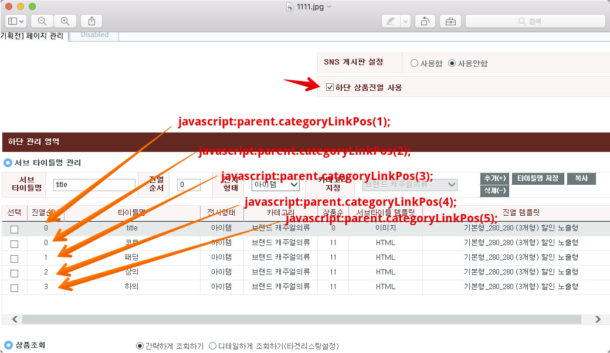

# 웹 CMTool 하단 진열상품 앵커텝 적용방법

하단 진열 상품에서 ~ 진열상품으로 앵커이동 에 대한 설명 입니다.


기획전 페이지 스크립트

```html
<!-- 기획전 메인 페이지에 스크립트 삽입 -->
<script type="text/javascript">
		function categoryLinkPos(num){
				var iElmPos1 = $("#ifrmItemList").offset().top;
				var iElmPos2 = $("#ifrmItemList").contents().find("#lblListing").contents("a").eq(num-1).next().offset().top;

				aboveHeight = $(window).scrollTop();

				if(aboveHeight <= 90){
						$('html, body').stop().animate({ scrollTop: iElmPos1+iElmPos2-90 }, "slow");
				} else {
						$('html, body').stop().animate({ scrollTop: iElmPos1+iElmPos2-45 }, "slow");
				}
		}
</script>
```


CMTOOL 하단 html

```html
<!-- /** 하단영역 관리에 html 형태로 삽입

        하단 진열상품 진열 사용의

        진열 순서 대로 진행

        javascript:parent.categoryLinkPos(1); 부터 시작
    **/ -->
    <!-- 코드 -->
	
    <map name="Map" id="Map">
      <area shape="rect" coords="4,5,120,48"   href="javascript:parent.categoryLinkPos(1);" onfocus="this.blur();"/>
      <area shape="rect" coords="123,4,243,49" href="javascript:parent.categoryLinkPos(2);" onfocus="this.blur();"/>
      <area shape="rect" coords="247,4,363,48" href="javascript:parent.categoryLinkPos(3);" onfocus="this.blur();"/>
      <area shape="rect" coords="368,4,485,49" href="javascript:parent.categoryLinkPos(4);" onfocus="this.blur();"/>
      <area shape="rect" coords="492,5,607,48" href="javascript:parent.categoryLinkPos(5);" onfocus="this.blur();"/>
      <area shape="rect" coords="612,5,729,49" href="javascript:parent.categoryLinkPos(6);" onfocus="this.blur();"/>
      <area shape="rect" coords="734,6,850,47" href="javascript:parent.categoryLinkPos(7);" onfocus="this.blur();"/>
      <area shape="rect" coords="856,6,978,47" href="javascript:parent.categoryLinkPos(8);" onfocus="this.blur();"/>
    </map>

    <!-- 자켓 -->
	
    <map name="Map" id="Map">
			<area shape="rect" coords="4,5,120,48"   href="javascript:parent.categoryLinkPos(1);" onfocus="this.blur();"/>
      <area shape="rect" coords="123,4,243,49" href="javascript:parent.categoryLinkPos(2);" onfocus="this.blur();"/>
      <area shape="rect" coords="247,4,363,48" href="javascript:parent.categoryLinkPos(3);" onfocus="this.blur();"/>
      <area shape="rect" coords="368,4,485,49" href="javascript:parent.categoryLinkPos(4);" onfocus="this.blur();"/>
      <area shape="rect" coords="492,5,607,48" href="javascript:parent.categoryLinkPos(5);" onfocus="this.blur();"/>
      <area shape="rect" coords="612,5,729,49" href="javascript:parent.categoryLinkPos(6);" onfocus="this.blur();"/>
      <area shape="rect" coords="734,6,850,47" href="javascript:parent.categoryLinkPos(7);" onfocus="this.blur();"/>
      <area shape="rect" coords="856,6,978,47" href="javascript:parent.categoryLinkPos(8);" onfocus="this.blur();"/>
    </map>

    <!-- 점퍼 -->
	
    <map name="Map" id="Map">
			<area shape="rect" coords="4,5,120,48"   href="javascript:parent.categoryLinkPos(1);" onfocus="this.blur();"/>
      <area shape="rect" coords="123,4,243,49" href="javascript:parent.categoryLinkPos(2);" onfocus="this.blur();"/>
      <area shape="rect" coords="247,4,363,48" href="javascript:parent.categoryLinkPos(3);" onfocus="this.blur();"/>
      <area shape="rect" coords="368,4,485,49" href="javascript:parent.categoryLinkPos(4);" onfocus="this.blur();"/>
      <area shape="rect" coords="492,5,607,48" href="javascript:parent.categoryLinkPos(5);" onfocus="this.blur();"/>
      <area shape="rect" coords="612,5,729,49" href="javascript:parent.categoryLinkPos(6);" onfocus="this.blur();"/>
      <area shape="rect" coords="734,6,850,47" href="javascript:parent.categoryLinkPos(7);" onfocus="this.blur();"/>
      <area shape="rect" coords="856,6,978,47" href="javascript:parent.categoryLinkPos(8);" onfocus="this.blur();"/>
    </map>
```



